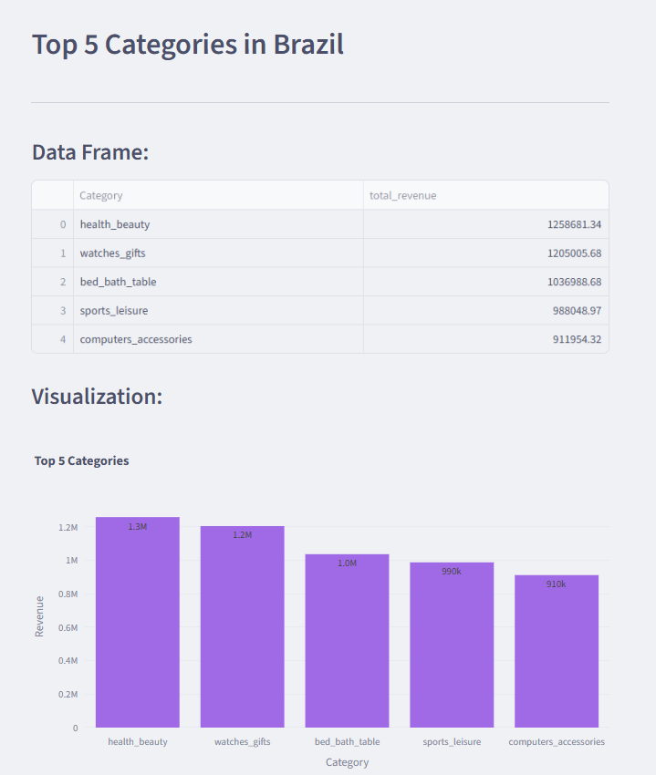
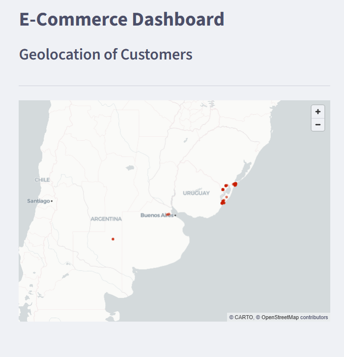
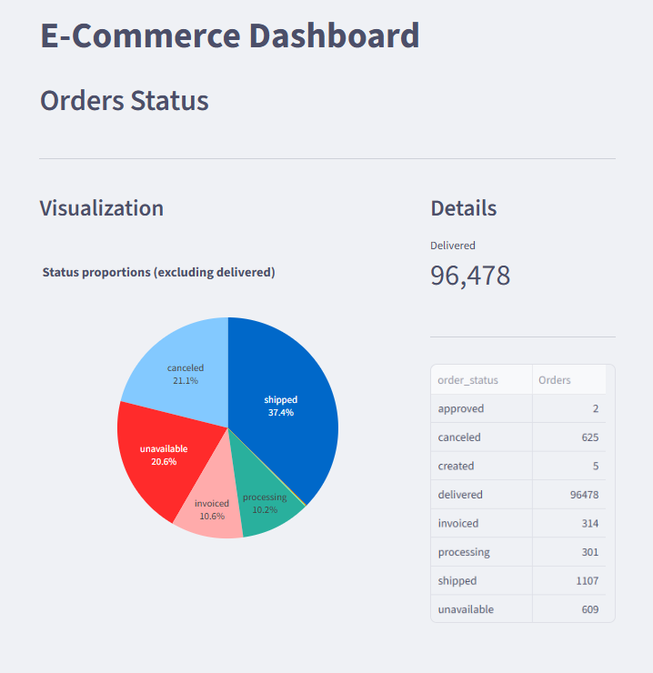
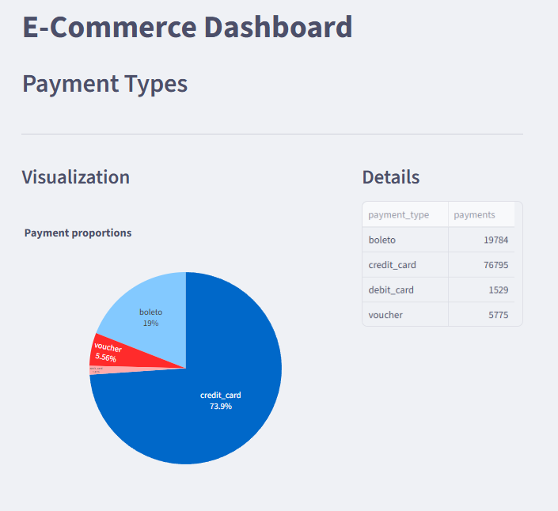
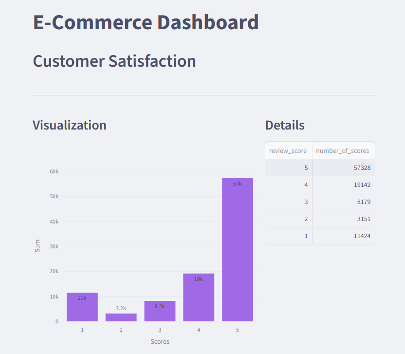
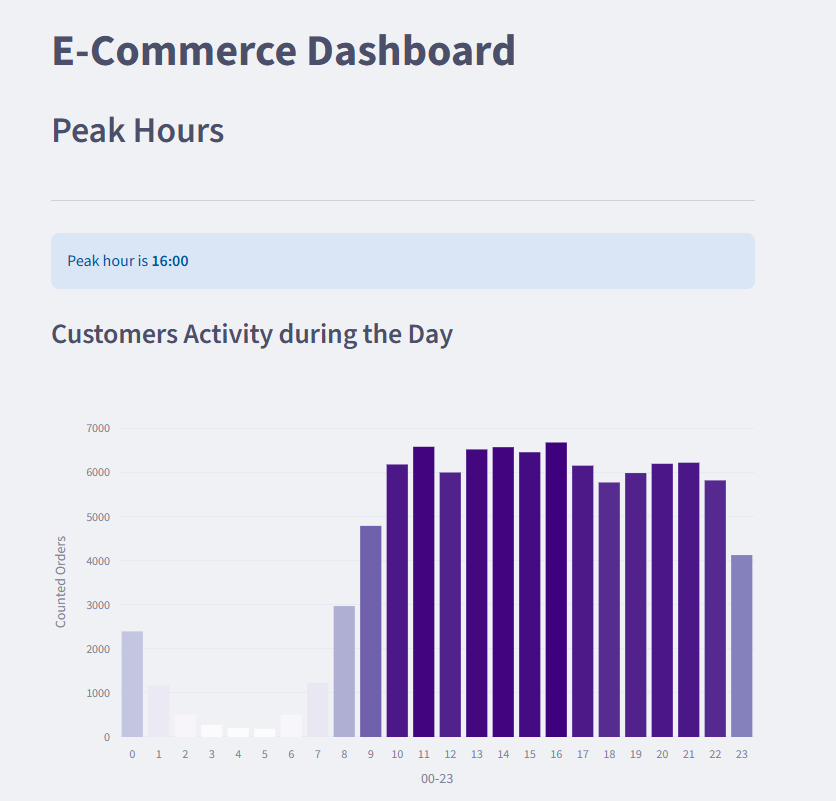

# E-Commerce Strategic Dashboard & Simulator


## Project Overview

This interactive Business Intelligence (BI) tool analyzes over **100,000 orders** from the Brazilian E-Commerce sector (Olist). It transforms raw data into actionable insights using a local Data Warehouse (SQLite) and provides a **Business Simulator** for financial forecasting.

### [Live Demo - Click Here](https://brecommerce-simulator-pggmfzeqhpbf4nf3fz3sw9.streamlit.app/)

---
<details>
<summary><strong>App Modules & Features</strong></summary>
<br>

The dashboard is divided into 8 strategic modules. Below is a detailed walkthrough of each feature.

### 1. Category Ranking (Top Products)
Identifies the best-selling product categories based on total revenue.
* **Tech:** SQL `JOIN` across 3 tables (Orders, Products, Translations).
* **Insight:** Highlights niche markets versus mass-market categories.




### 2. Geolocation Map
Visualizes customer distribution across Brazil using latitude/longitude data.
* **Tech:** Streamlit `st.map` integrated with geolocation dataset.
* **Insight:** Shows concentration of sales in coastal cities vs. interior regions.



### 3. Sales Trends (Time Series)
Analyzes revenue growth from 2016 to 2018.
* **Tech:** SQL `strftime` for monthly aggregation and Plotly Line Charts.
* **Insight:** Identifies seasonal trends (e.g., Black Friday spikes).


### 4. Business Simulator (What-If Analysis)
An interactive decision-support tool. Allows stakeholders to simulate changes in **Product Price** and **Freight Costs** to forecast Revenue.
* **Tech:** Dynamic Python calculation using `st.slider`.
* **Value:** Helps in planning pricing strategies and margin estimation.


### 5. Orders Status (Logistics)
Breakdown of delivery performance. Monitors successful deliveries vs. cancellations.
* **Tech:** SQL `GROUP BY` and Donut Charts.
* **Metric:** Tracks the "Cancellation Rate" KPI.



### 6. Payment Types
Analysis of preferred payment methods by customers.
* **Tech:** Data aggregation and Pie Charts.
* **Insight:** Credit Card vs. Boleto (Cash) usage distribution.



### 7. Customer Satisfaction (Reviews)
Analysis of customer sentiment based on 1-5 star ratings.
* **Tech:** Horizontal Bar Chart with Red-Green color scale.
* **Insight:** Quality Assurance metric monitoring.



### 8. Peak Hours (Customer Behavior)
Heatmap analysis identifying the busiest hours of the day.
* **Tech:** SQL Hour extraction and Color-coded Bar Chart.
* **Insight:** Determines optimal times for marketing campaigns (e.g., 14:00 - 16:00).


</details>

<details>
<summary><strong> Technology Stack</strong></summary>
<br>

* **Python 3.10+**
* **Streamlit**
* **SQLite**
* **Plotly Express**
* **Pandas**
  
</details>

<details>
<summary><strong> How to Run Locally</strong></summary>
<br>

1.  **Clone the repository:**
    ```bash
    git clone [https://github.com/NataliaKalista/BrECommerce-Simulator.git](https://github.com/NataliaKalista/BrECommerce-Simulator.git)
    ```
2.  **Install requirements:**
    ```bash
    pip install -r requirements.txt
    ```
3.  **Run the app:**
    ```bash
    streamlit run dashboard.py
    ```
    *(Note: The database `brEcommerce.db` is automatically extracted from the ZIP archive on the first run to bypass GitHub file size limits).*
</details>
