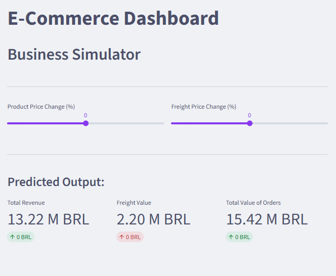

# E-Commerce Strategic Dashboard

An interactive Business Intelligence (BI) tool built with Python to analyze sales data from Olist (Brazilian E-Commerce).
This project demonstrates end-to-end data analysis skills: from Data Engineering (ETL, SQL) to Frontend visualization and Decision Support Systems.



 **[View Live App](https://brecommerce-simulator-pggmfzeqhpbf4nf3fz3sw9.streamlit.app/)** 

## Project Overview
The goal of this project was to transform raw CSV files into actionable business insights. The dashboard serves as a central hub for stakeholders to track KPIs and simulate business decisions.

**Key achievements:**
- Built a local **Data Warehouse** using SQLite (migrating from CSVs).
- Developed complex **SQL queries** (Joins across 4 tables, Aggregations, Date functions).
- Implemented a **Business Simulator** to forecast revenue changes.

## Key Features
The application consists of 4 main modules:

1.  **Category Ranking**
    - Analysis of top-performing product categories.
    - Uses **SQL JOINS** to connect *Order Items*, *Products*, and *English Translations*.
    - Filters data to include only delivered orders.

2.  **Geolocation Map**
    - Interactive visualization of customer distribution across Brazil.
    - Bridges *Orders* and *Geolocation* tables via *Customers* table (Double Join).

3.  **Sales Trends**
    - Time-series analysis showing revenue growth from 2016 to 2018.
    - Utilizes SQL `strftime` function for monthly aggregation.

4.  **Business Simulator (What-If Analysis)**
    - An interactive tool for decision-makers.
    - Allows users to adjust **Product Price** and **Freight Cost** via sliders.
    - Real-time calculation of potential profit/loss using Python logic.

##  Tech Stack
* **Python 3.14**
* **Streamlit:** Web application framework.
* **SQLite:** Relational Database (Data Storage).
* **Pandas:** Data manipulation and ETL.
* **Plotly Express:** Interactive, professional visualizations.

## Installation & Usage
This project handles large data limits on GitHub by compressing the database.

1.  **Clone the repository:**
    ```bash
    git clone [https://github.com/NataliaKalista/ecommerce-dashboard.git](https://github.com/NataliaKalista/ecommerce-dashboard.git)
    ```
2.  **Install dependencies:**
    ```bash
    pip install -r requirements.txt
    ```
3.  **Run the application:**
    ```bash
    streamlit run dashboard.py
    ```
    *(Note: The script automatically unzips `brEcommerce.zip` on the first run).*

## Data Source
The dataset is provided by **Olist** and contains ~100k orders from 2016 to 2018 in Brazil.
Original source: [Kaggle - Brazilian E-Commerce Public Dataset](https://www.kaggle.com/datasets/olistbr/brazilian-ecommerce)

---
*Created by [Twoje Imię i Nazwisko]*
